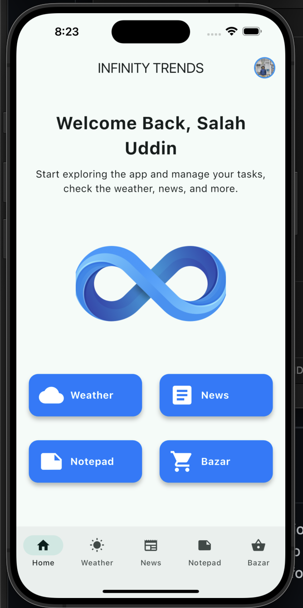
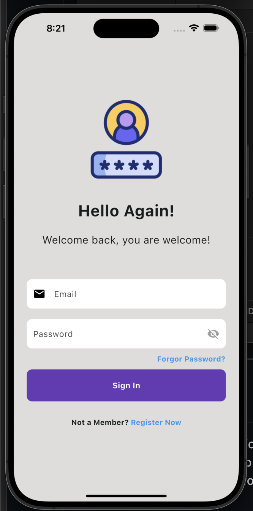
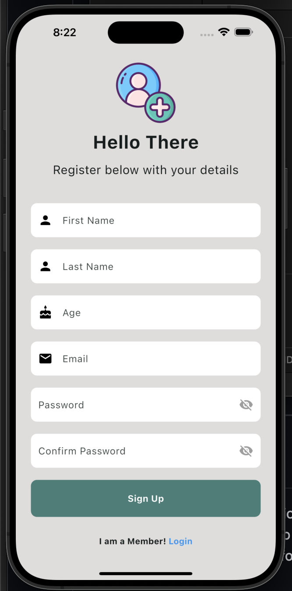
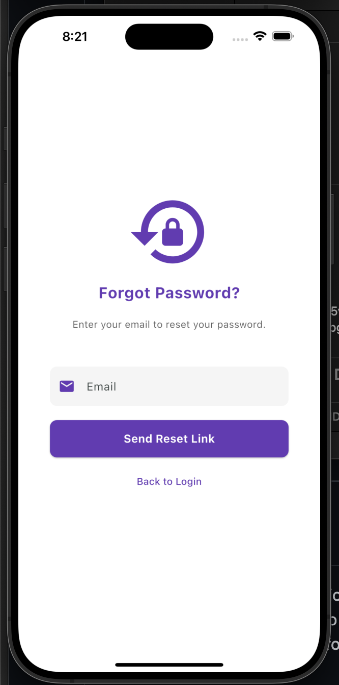
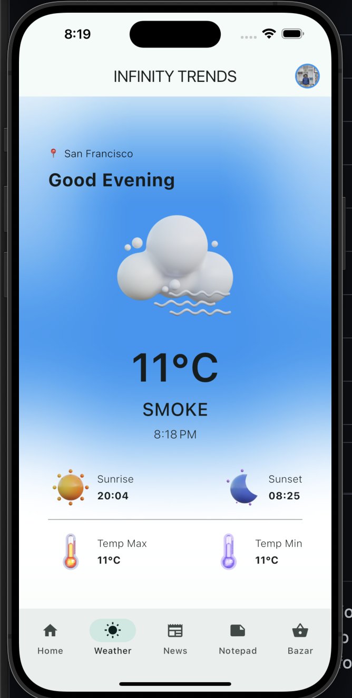
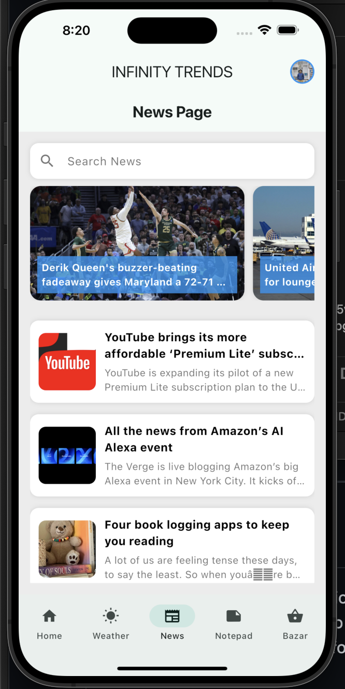
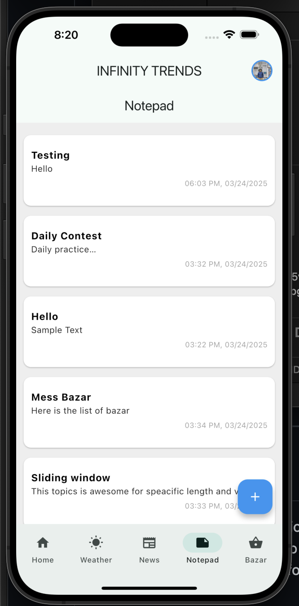
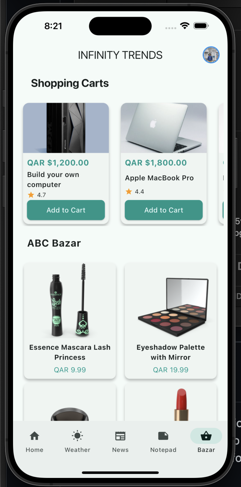
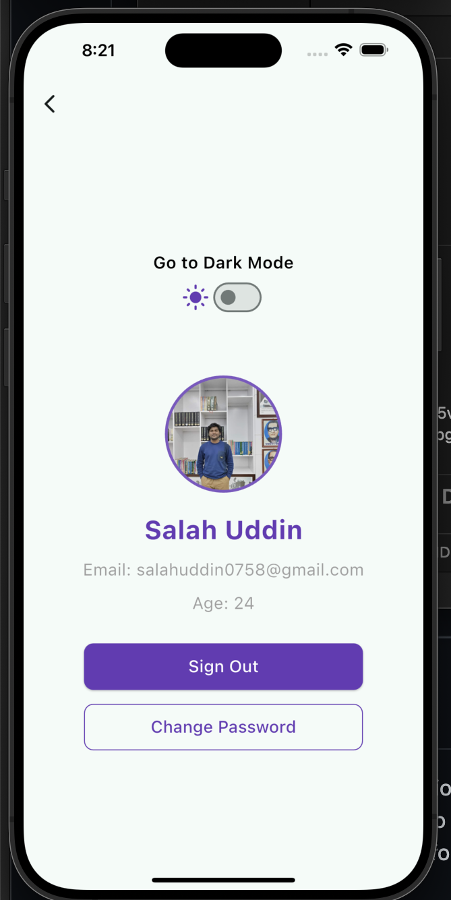

# Infinity Trend  

Infinity Trend is a multi-functional Flutter app with features like weather updates, news, a notepad, and a profile page. The app allows users to store and retrieve notes individually, thanks to Firebase integration. It also uses REST APIs to fetch live data for the weather and news. The app follows a state management pattern using Flutter BLoC and Dart.

## Features  

- **Home Page**: The main landing page that gives a brief overview of the app.  
- **Weather Page**: Shows real-time weather data fetched from a weather API.  
- **News Page**: Displays the latest news articles using a news API.  
- **Notepad**: Allows users to create, edit, and delete notes. Notes are stored and retrieved on Firebase, with individual user data.  
- **Profile Page**: Allows users to view and manage their profile settings.  

## Firebase Integration  

- Firebase is used to store user-specific data (notes).  
- Firebase Authentication handles user login and registration.  
- Firestore Database stores notes for each individual user.  

## APIs  

- **Weather API**: Fetches live weather updates for the user's location.  
- **News API**: Provides the latest news articles, categorized for the user.  

## State Management  

- The app uses **Flutter BLoC** (Business Logic Component) for managing state and making the app scalable and maintainable.  

## Tech Stack  

- **Flutter**: Cross-platform app development.  
- **Dart**: Programming language used for the app.  
- **Firebase**: Backend service for user authentication and data storage.  
- **BLoC**: State management solution.  
- **REST API**: For fetching live weather and news data.  

---

# **Project Overview**  

Below is a step-by-step visual guide to the app’s interface.  

## **1. Home Page**  
This is the main landing page, providing access to different features.  



---

## **2. Login Page**  
Users can log in to their accounts using Firebase Authentication.  



---

## **3. Signup Page**  
New users can register by creating an account.  



---

## **4. Reset Password Page**  
Users can reset their passwords via email.  



---

## **5. Weather Page**  
Displays real-time weather updates based on the user's location.  



---

## **6. News Page**  
Fetches the latest news articles from the API.  



---

## **7. Notepad**  
Users can create, edit, and delete notes, which are stored in Firebase.  



---

## **8. Shopping Page**  
A feature that allows users to manage shopping lists.  



---

## **9. Profile Page**  
Users can view and update their profile settings.  



---

## Setup  

### Prerequisites  

- Install [Flutter](https://flutter.dev/docs/get-started/install).  
- Install [Dart](https://dart.dev/get-dart).  
- Create a Firebase project and configure it with your app.  

### Installation  

1. Clone the repository:  
    ```bash
    git clone https://github.com/salahuddinjony/Infinity_trend.git
    ```
2. Navigate to the project directory:  
    ```bash
    cd Infinity_trend
    ```
3. Install dependencies:  
    ```bash
    flutter pub get
    ```
4. Set up Firebase:  
    - Follow the Firebase setup guide for [Android](https://firebase.flutter.dev/docs/overview#installation) and [iOS](https://firebase.flutter.dev/docs/overview#installation).  
    - Add your `google-services.json` for Android and `GoogleService-Info.plist` for iOS to your project.  

5. Run the app:  
    ```bash
    flutter run
    ```

---

## Contributing  

Feel free to fork the project and create a pull request. Please follow the established code style and structure.  

---

## License  

This project is licensed under the MIT License - see the [LICENSE](LICENSE) file for details.  

---

## Acknowledgements  

- [Flutter](https://flutter.dev/)  
- [Firebase](https://firebase.google.com/)  
- [BLoC](https://pub.dev/packages/flutter_bloc)  
- [Weather API](https://openweathermap.org/api)  
- [News API](https://newsapi.org/)  
